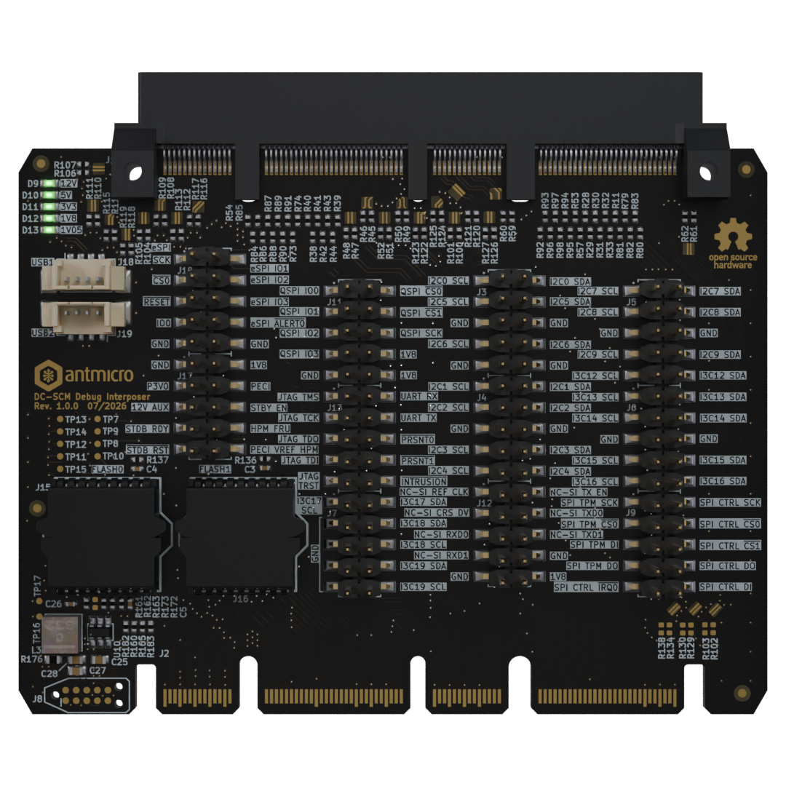

# DC-SCI Debug Interposer

Copyright (c) 2026 [Antmicro](https://www.antmicro.com)

## Overview

This project includes desing files for a printed circuit board that can be connected between DC-SCM (BMC) unit and host (server) platform that is controlled by the BMC.
The board exposes all relevant IO interfaces provided by the DC-SCI rev.2.x. in order to streamline the DC-SCM software development and aid the server platform (HPM) bringup.
All single-ended signals are exposed on 2.54 mm headers to simplify the debugging setup.
The on-board SOP-16 sockets provide an easy way for BIOS injection.
The DC-SCI Debug Interposer board also exposes two USB headers connected to the `PCIE_HPMROOT_5` interface compatible with HPM Common Circuit Type 1 Design Specification.

## Key features

* Compatible with DC-SCM 2.x
* All single ended DC-SCI signals exposed on 2.54 mm (0.1 inch) pin headers
* Two sockets for SPI Flash memories with BIOS image
* 2-port USB controller connected to DC-SCI PCIE_HPMROOT_5 (assembly option)
* 68 x 90 mm (2.67 x 3.54 inch) PCB outline

## Project structure

The main directory contains KiCad PCB project files, the LICENSE, and this README, and the img directory contains graphics for this README.

## License

This project is licensed under the [Apache-2.0](LICENSE) license.
