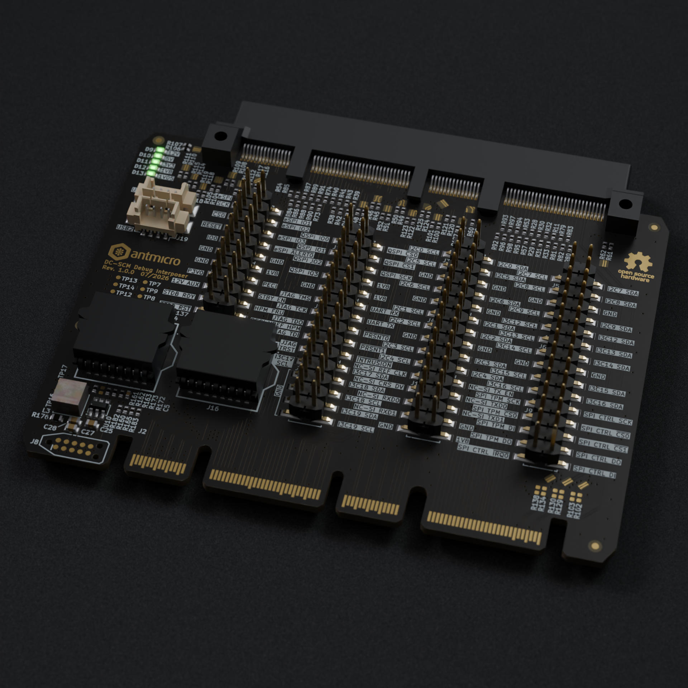

# DC-SCM Debug Interposer

Copyright (c) 2026 [Antmicro](https://www.antmicro.com)

## Overview

This project contains open hardware design files for a DC-SCM interposer board exposing IO interfaces offered by Data Center Secure Control Modules (DC-SCM) rev.2.x.
This board aids BMC software development and allows for initial testing of the DC-SCM card before plugging it into the matching HPM.
The design files were prepared in KiCad 10.

## Key features

* 
* 

## Project structure

The main directory contains KiCad PCB project files, the LICENSE, and this README, and the img directory contains graphics for this README.

## License

This project is licensed under the [Apache-2.0](LICENSE) license.
